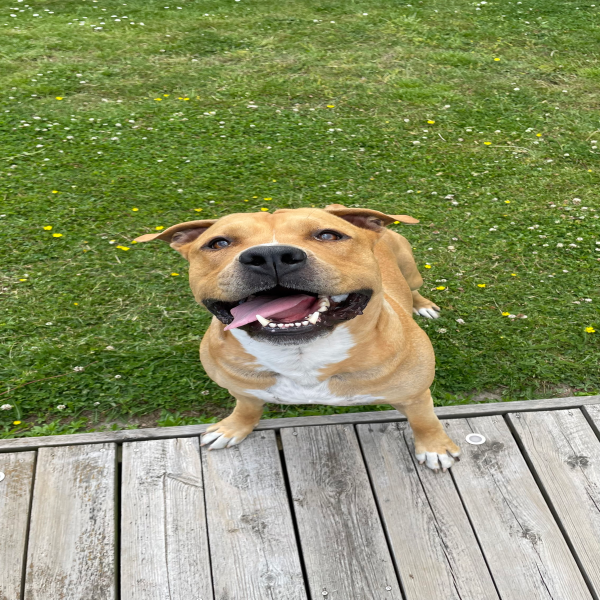

# README

Med hjälp av denna modulen så kan du redigera bilder även om du bara vill ändra storleken på dem eller om du vill göra flera saker som att ändra ljusstyrka eller rotera bilden.

## Features

Bilden jag kommer använda för att visa resultaten ser ut såhär innan den är redigerad:

### Editor

ImageEditorn kan du använda om du vill lätt kunna hantera bilderna som redigeras. Den har en funktion setImage() för att sätta en ny bild där parametern är en BufferedImage, en funktion getImage() för att hämta den nuvarande bilden och sedan för att spara ner den nuvarande bilden så används saveImage() där parametrarna båda är en String men den första är vilken typ av bild du vill att den ska sparas ner som och den andra är filvägen till där du vill spara ner bilden tillsammans med namnet på bilden du vill ha i slutet.

    ImageEditor editor = new ImageEditor("images/hardy.png");
    BufferedImage resizedImage = resizer.resizeImage(editor.getImage(), 600, 600);
    editor.setImage(resizedImage);
    editor.saveImage("png", "images/hardy1.png");

### Resizing

Klassen ImageResizer används för att ändra storlek på bilder. Parametrarna är: bilden som du vill redigera, nya bredden på bilden i pixlar, nya höjden på bilden i pixlar.

            ImageResizer resizer = new ImageResizer();
            BufferedImage resizedImage = resizer.resizeImage(editor.getImage(), 600, 600);

Här är ett exempel på hur bilden ser ut efter denna koden:

### Rotation

ImageRotator används för att rotera bilder. Parametrarna är: bilden som du vill redigera, antalet grader du vill rotera bilden med (positiva tal roterar bilden åt höger och negativa tal åt vänster).

            ImageRotator rotator = new ImageRotator();
            BufferedImage rotatedImage = rotator.rotateImage(editor.getImage(), 45);

Här är ett exempel på hur bilden ser ut efter denna koden:

### Brightness

ImageBrightnessAdjuster är till för att ljustera ljusstyrkan på bilder. Parametrarna är: bilden som du vill redigera, hur mycket du vill multiplicera bildens ljusstyrka med (som float) där 1 då är bildens standard ljusstyrka.

            ImageBrightnessAdjuster brightnessAdjuster = new ImageBrightnessAdjuster();
            BufferedImage brightenedImage = brightnessAdjuster.adjustBrightness(editor.getImage(), 1.4f);

Här är ett exempel på hur bilden ser ut efter denna koden:

### Color filters

ImageColorFilter används oftast om man vill ta bort en viss färg från en bild eller om man vill att en viss färg ska vara mer tydlig. Parametrarna är: bilden som du vill redigera, hur mycket du vill multiplicera bildens röda färg med (som float) där 1 då är bildens standard färg, hur mycket du vill multiplicera bildens gröna färg med (som float) där 1 då är bildens standard färg, hur mycket du vill multiplicera bildens blåa färg med (som float) där 1 då är bildens standard färg. Kodexemplet under tar då bort all grön färg ur bilden.

            ImageColorFilter colorFilter = new ImageColorFilter();
            BufferedImage filteredImage = colorFilter.adjustColor(editor.getImage(), 1f, 0f, 1f);

Här är ett exempel på hur bilden ser ut efter denna koden:

### Invert colors

NegativeColorConverter gör så att din bilds färger blir inverterade, exempelvis blir vit färg till svart och grön blir till rosa. Parametrarna är: bilden som du vill redigera.

            NegativeColorConverter colorConverter = new NegativeColorConverter();
            BufferedImage convertedImage = colorConverter.convertColors(editor.getImage());

Här är ett exempel på hur bilden ser ut efter denna koden:

### Grey scale

GreyScaleImage gör din bild till en färglös bild, med andra ord svartvit. Parametrarna är: bilden som du vill redigera.

            GrayScaleImage grayScaler = new GrayScaleImage();
            BufferedImage grayImage = grayScaler.grayScale(editor.getImage());

Här är ett exempel på hur bilden ser ut efter denna koden:

### Color saturation

ColorSaturator ändrar "mättnaden" på din bild vilket avgör hur starka färgerna blir. Destå lägre värde du skickar in desto mer grå och färglös blir bilden medans om du väljer ett högre värde så sticker färgerna ut mer. Parametrarna är: bilden som du vill redigera, hur mycket "mättnad" du vill ha i bilden i procent (då 100 är samma värde som bilden redan har).

            ColorSaturator colorSaturator = new ColorSaturator();
            BufferedImage saturatedImage = colorSaturator.saturateImage(editor.getImage(), 200);

Här är ett exempel på hur bilden ser ut efter denna koden:

## Användning

För att använda denna modulen så får du börja med att ladda ner mappen [app](https://github.com/Jollepolle123/L2/tree/main/app/src/main/java/org/example/app) (eller bara filerna) och sedan lägga dem i mappen för det projektet du vill använda dem.

Sedan så behövs de klasserna som du vill använda importeras så om du exempelvis ska använda dig av alla funktioner så görs det med:

    import app.ImageEditor;
    import app.ImageResizer;
    import app.ImageRotator;
    import app.ImageBrightnessAdjuster;
    import app.ImageColorFilter;
    import app.NegativeColorConverter;
    import app.GrayScaleImage;
    import app.ColorSaturator;

## Exempel

Exempel på hur du kan implementera detta i din egen kod hittar du i [Example.java](https://github.com/Jollepolle123/L2/blob/main/app/src/main/java/org/example/app/Example.java).  
Jag har även exemplerna på hur bilderna ser ut när man kör min exempel kod och dem ligger i mappen [app/images](https://github.com/Jollepolle123/L2/tree/main/app/images).