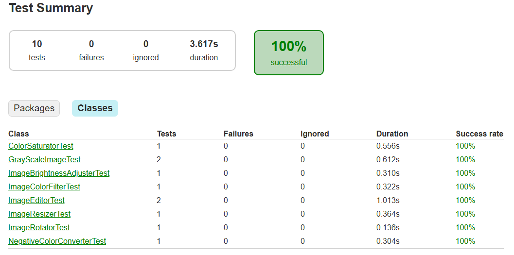

# Testrapport

För att testa min kod har jag skrivit några tester som körs när man kör gradle build. Det jag testar först med testBrightnessAdjustment() är min adjustBrightness funktion genom att jämföra min bilds färger med bilden som jag fick tillbaks när jag kört adjustBrightness på den.  
När jag testar adjustColor() så skapar jag en bild som jag bara ändrar den blåa färgen på och sedan kollar jag så att den gröna och röda är oförändrade från orginalbilden och så att den blåa inte är samma.
Mitt tredje test kollar så att min ImageEditor laddar in bilden korrekt, och det tredje testet är på ImageEditorn med, där den då testar så att det fungerar att spara ner en bild genom att först köra saveImage() och sedan kolla så att filen faktist finns.  
För att testa min resizeImage() funktion så kör jag den på en bild och kollar sedan om bilden jag får tillbaks har samma hjöd och bredd som jag satt att jag ville ha.  
Testet för convertColors() så kollar jag så att rgb värdena från en pixel inte är samma som orginal bilden.
När jag testar funktionen saturateImage() så skapar jag en saturated bild med 200% saturation och jämför sedan saturation värdet med orginalbilden och kollar så att den är större.
Testen för greyScale() testar först så att färgerna inte är samma som orginalbilden och i det andra testet kollar den så att den röda, gröna och blåa färgen har samma värde.
Till sist så testar jag rotateImage() genom att kolla så att det jag inte får tillbaks är null, men för att faktist testa funktionen så att den verkligen roterar bilden kan jag spara ner bilden och sedan manuellt kolla på bilden.

